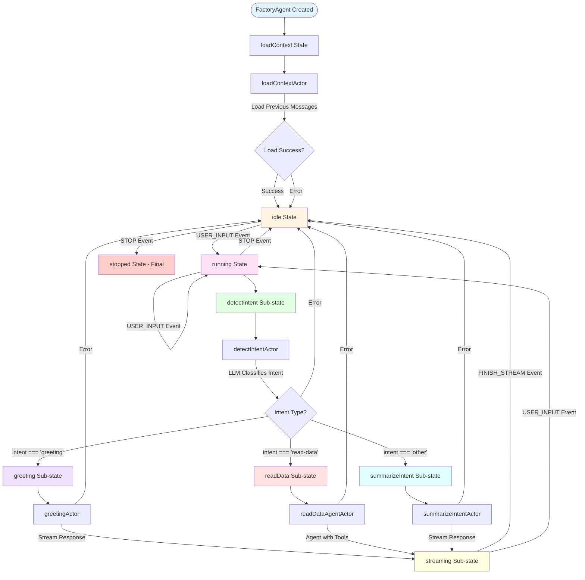
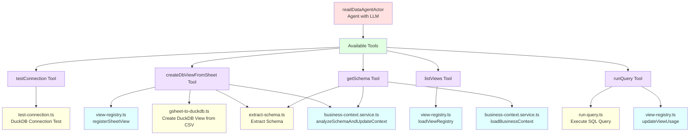
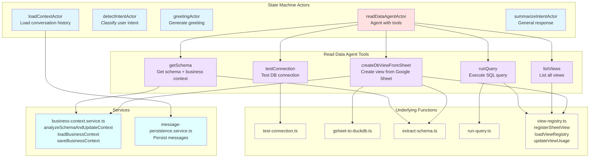

# Agent Factory Decision Flow

## Main State Machine Flow

## Read Data Agent Tools & Services

## Complete Actor & Tool Architecture

## State Machine Details

### Main States
- **loadContext**: Initial state, loads conversation history
- **idle**: Waiting for user input
- **running**: Processing user request (contains sub-states)
- **stopped**: Final state (terminated)

### Running Sub-States
- **detectIntent**: Uses LLM to classify user intent
- **greeting**: Handles greeting messages
- **readData**: Handles data reading queries with tools
- **summarizeIntent**: Handles other/general queries
- **streaming**: Streams response to client

### All Actors
- **loadContextActor**: Loads previous messages from repository using `GetMessagesByConversationIdService`
- **detectIntentActor**: Uses LLM (`azure/gpt-5-mini`) with `generateObject` to classify intent (greeting/read-data/other)
- **greetingActor**: Uses `streamText` with `azure/gpt-5-mini` to generate greeting response
- **readDataAgentActor**: Agent (`Experimental_Agent`) with 5 tools, max 20 steps, uses `azure/gpt-5-mini`
- **summarizeIntentActor**: Uses `streamText` with `azure/gpt-5-mini` to generate general response

### Read Data Agent Tools
1. **testConnection**: Tests DuckDB connection
   - Uses: `test-connection.ts` → DuckDB API

2. **createDbViewFromSheet**: Creates DuckDB view from Google Sheet
   - Uses: `view-registry.ts` (registerSheetView) → `gsheet-to-duckdb.ts` → `extract-schema.ts` → `business-context.service.ts` (analyzeSchemaAndUpdateContext)

3. **listViews**: Lists all available views
   - Uses: `view-registry.ts` (loadViewRegistry)

4. **getSchema**: Gets schema and business context
   - Uses: `extract-schema.ts` → `business-context.service.ts` (loadBusinessContext, analyzeSchemaAndUpdateContext)

5. **runQuery**: Executes SQL query
   - Uses: `run-query.ts` → `view-registry.ts` (updateViewUsage)

### Underlying Functions & Services
- **test-connection.ts**: Tests DuckDB connection
- **gsheet-to-duckdb.ts**: Converts Google Sheet CSV to DuckDB view
- **extract-schema.ts**: Extracts schema from DuckDB views
- **run-query.ts**: Executes SQL queries on DuckDB
- **view-registry.ts**: Manages view registry (registerSheetView, loadViewRegistry, updateViewUsage)
- **business-context.service.ts**: Manages business context (analyzeSchemaAndUpdateContext, loadBusinessContext, saveBusinessContext)
- **message-persistence.service.ts**: Persists messages to repository

### Events
- **USER_INPUT**: User sends a message
- **FINISH_STREAM**: Stream completed
- **STOP**: Stop processing

### Guards
- **isGreeting**: Checks if intent === 'greeting'
- **isReadData**: Checks if intent === 'read-data'
- **isOther**: Checks if intent === 'other'

